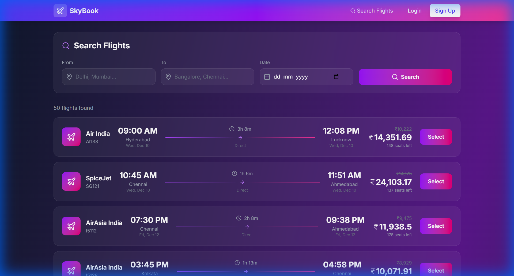
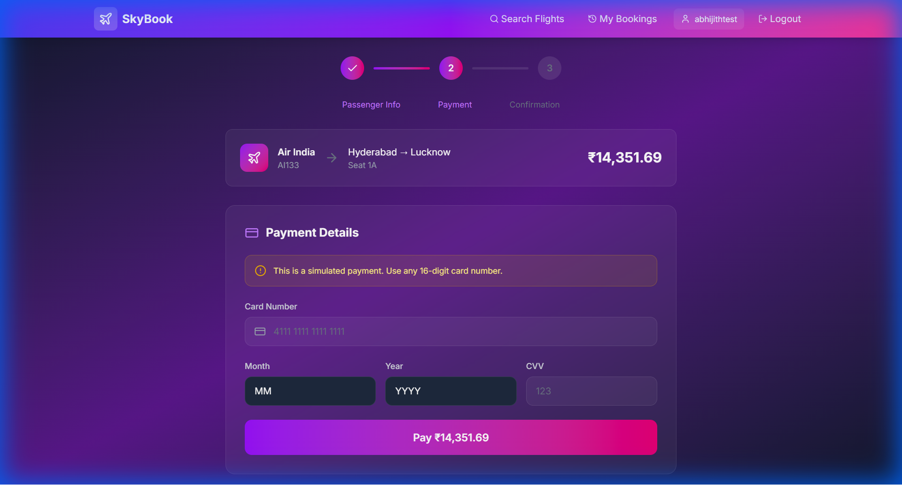
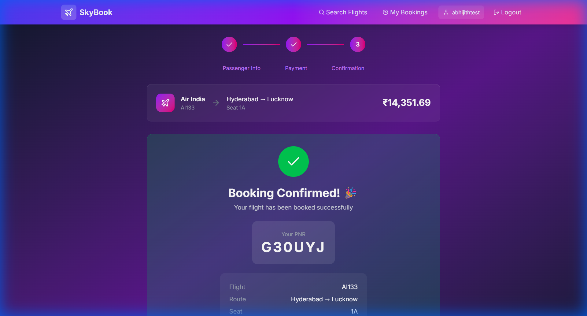

# 🛫 SkyBook - Flight Booking App Simulator

A full-stack flight booking application built with **FastAPI** (backend) and **React + Tailwind CSS** (frontend). Features dynamic pricing, multi-step booking flow, real-time seat selection, and secure JWT authentication.


## ✨ Features

### Core Functionality
- **🔐 User Authentication** - JWT-based registration, login, and session management
- **🔍 Flight Search** - Search flights by source, destination, and date with real-time filtering
- **💰 Dynamic Pricing** - Prices adjust based on seat availability, time to departure, and demand
- **🪑 Interactive Seat Selection** - Visual seat map with real-time availability
- **📝 Multi-Step Booking** - Guided flow: Seat Selection → Passenger Info → Payment
- **🎫 PNR Generation** - Unique 6-character booking confirmation codes
- **📊 Booking History** - View and manage all your bookings
- **❌ Cancellation** - Cancel bookings with automated refund calculation

### Technical Highlights
- **Concurrency Control** - Database transactions prevent double booking
- **Demand Simulation** - Background task simulates real-world demand fluctuations
- **Responsive Design** - Works seamlessly on desktop and mobile
- **API Documentation** - Interactive Swagger UI documentation

## 🛠️ Tech Stack

### Backend
| Technology | Purpose |
|------------|---------|
| FastAPI | REST API framework |
| SQLAlchemy | ORM & database management |
| SQLite | Database (easily swappable to PostgreSQL) |
| Pydantic | Data validation & serialization |
| python-jose | JWT token handling |
| passlib + bcrypt | Password hashing |

### Frontend
| Technology | Purpose |
|------------|---------|
| React 18 | UI framework |
| Vite | Build tool & dev server |
| Tailwind CSS 4 | Styling |
| React Router | Client-side routing |
| Axios | HTTP client |
| Lucide React | Icons |
| React Hot Toast | Notifications |

## 📁 Project Structure

```
InfosysSpringBoardFinalProject/
├── app/                          # Backend application
│   ├── database/
│   │   ├── connection.py         # Database configuration
│   │   └── models.py             # SQLAlchemy ORM models
│   ├── routes/
│   │   ├── user_routes.py        # Auth endpoints
│   │   ├── flight_routes.py      # Flight search endpoints
│   │   └── booking_routes.py     # Booking flow endpoints
│   ├── schemas/
│   │   ├── user.py               # User Pydantic models
│   │   ├── flight.py             # Flight Pydantic models
│   │   └── booking.py            # Booking Pydantic models
│   ├── services/
│   │   ├── user_service.py       # User business logic
│   │   ├── flight_service.py     # Flight business logic
│   │   ├── booking_service.py    # Booking business logic
│   │   └── pricing_engine.py     # Dynamic pricing algorithm
│   ├── tasks/
│   │   └── demand_simulator.py   # Background demand simulation
│   └── utils/
│       ├── auth.py               # JWT & authentication utilities
│       ├── pnr_generator.py      # PNR generation
│       └── seed_data.py          # Sample data generator
├── frontend/                     # React frontend
│   ├── src/
│   │   ├── components/           # Reusable UI components
│   │   ├── context/              # React context (Auth)
│   │   ├── pages/                # Page components
│   │   └── services/             # API service layer
│   ├── index.html
│   └── vite.config.js
├── main.py                       # FastAPI application entry point
├── requirements.txt              # Python dependencies
└── README.md
```

## 🚀 Getting Started

### Prerequisites
- Python 3.9+
- Node.js 18+
- npm or yarn

### Backend Setup

1. **Clone the repository**
   ```bash
   git clone https://github.com/yourusername/flight-booking-app.git
   cd flight-booking-app
   ```

2. **Create virtual environment**
   ```bash
   python -m venv venv
   source venv/bin/activate  # On Windows: venv\Scripts\activate
   ```

3. **Install dependencies**
   ```bash
   pip install -r requirements.txt
   ```

4. **Run the backend**
   ```bash
   uvicorn main:app --reload --port 8000
   ```

5. **Access API Documentation**
   - Swagger UI: http://localhost:8000/docs
   - ReDoc: http://localhost:8000/redoc

### Frontend Setup

1. **Navigate to frontend directory**
   ```bash
   cd frontend
   ```

2. **Install dependencies**
   ```bash
   npm install
   ```

3. **Run the development server**
   ```bash
   npm run dev
   ```

4. **Open the app**
   - Frontend: http://localhost:3000

## 📊 API Endpoints

### Authentication
| Method | Endpoint | Description |
|--------|----------|-------------|
| POST | `/api/users/signup` | Register new user |
| POST | `/api/users/login` | Login & get JWT token |
| POST | `/api/users/logout` | Logout user |
| GET | `/api/users/profile` | Get user profile |

### Flights
| Method | Endpoint | Description |
|--------|----------|-------------|
| GET | `/api/flights` | Search flights with filters |
| GET | `/api/flights/{id}` | Get flight details |
| GET | `/api/flights/{id}/seats` | Get available seats |
| GET | `/api/flights/{id}/pricing` | Get pricing breakdown |

### Bookings
| Method | Endpoint | Description |
|--------|----------|-------------|
| POST | `/api/bookings/select-seat` | Step 1: Reserve seat |
| POST | `/api/bookings/{id}/passenger` | Step 2: Add passenger info |
| POST | `/api/bookings/{id}/payment` | Step 3: Process payment |
| GET | `/api/bookings/history` | Get user's bookings |
| GET | `/api/bookings/pnr/{pnr}` | Lookup by PNR |
| DELETE | `/api/bookings/{id}` | Cancel booking |

## 💰 Dynamic Pricing Algorithm

The pricing engine calculates real-time prices using multiple factors:

```
Final Price = Base Price × Seat Factor × Time Factor × Demand Factor
```

### Seat Factor (1.0 - 2.0)
| Availability | Multiplier |
|--------------|------------|
| > 80% seats available | 1.0x |
| 50-80% available | 1.2x |
| 20-50% available | 1.5x |
| < 20% available | 2.0x |

### Time Factor (1.0 - 1.5)
| Days to Departure | Multiplier |
|-------------------|------------|
| > 7 days | 1.0x |
| 3-7 days | 1.2x |
| 1-3 days | 1.3x |
| < 24 hours | 1.5x |

### Demand Factor (0.8 - 1.5)
Simulated by background task, adjusts based on booking patterns and route popularity.

## 🔒 Security Features

- **Password Hashing** - bcrypt with salt
- **JWT Tokens** - 24-hour expiry, secure signing
- **Concurrency Control** - Database transactions prevent double booking
- **Input Validation** - Pydantic models validate all inputs

## 📸 Screenshots

### Flight Search


### Seat Selection


### Booking Confirmation


## 🧪 Testing

```bash
# Run backend tests
pytest tests/

# Run with coverage
pytest --cov=app tests/
```

## 🔧 Configuration

### Environment Variables (Optional)
Create a `.env` file in the root directory:

```env
SECRET_KEY=your-super-secret-key-change-in-production
ALGORITHM=HS256
ACCESS_TOKEN_EXPIRE_MINUTES=1440
DATABASE_URL=sqlite:///./flight_booking.db
```

## 🚀 Deployment

### Backend (Production)
```bash
gunicorn main:app -w 4 -k uvicorn.workers.UvicornWorker
```

### Frontend (Production)
```bash
cd frontend
npm run build
# Serve dist folder with nginx or similar
```

## 🤝 Contributing

1. Fork the repository
2. Create a feature branch (`git checkout -b feature/amazing-feature`)
3. Commit your changes (`git commit -m 'Add amazing feature'`)
4. Push to the branch (`git push origin feature/amazing-feature`)
5. Open a Pull Request

## 📝 License

This project is licensed under the MIT License - see the [LICENSE](LICENSE) file for details.

## 👏 Acknowledgments

- Built as part of Infosys Springboard Final Project
- Icons by [Lucide](https://lucide.dev/)
- UI inspiration from modern airline booking systems

---

Made with ❤️ by Abhijith
